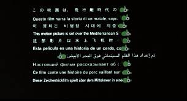
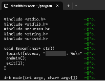

# pig_Command
このリポジトリはC言語を用いてpigコマンドを作成します。
### pigコマンドとは
スタジオジブリの映画「紅の豚」のオープニングのタイプライターのような雰囲気でテキストファイルを表示するcatコマンドです。
時代は猫ではなく豚です。<span style="color:green;">@^o .</span>



実行イメージ



全角文字には現在対応できていません。勉強を続けます
### curses.h
C言語のcursesライブラリを使用して端末を操作します。
釧路高専さんのWebサイトを参考にさせて頂きました。
[cursesによる端末操作](https://www.kushiro-ct.ac.jp/yanagawa/ex-2017/2-game/01.html)

### コンパイルと実行
コンパイル
```
cc main.c -o pig -lncurses
```
実行
```
./pig textfile
```
/binディレクトリに作成したpigファイルをコピーすることでどこからでも実行できます
